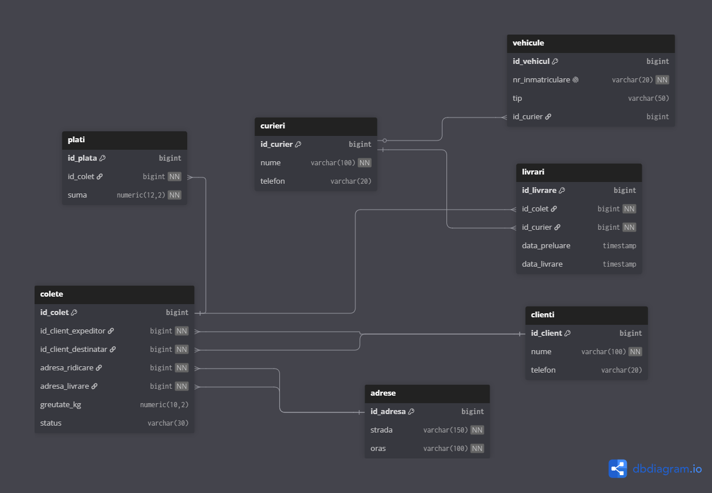

# 🚚 Curier Database Project

## 📌 Descriere
Acest proiect reprezintă o bază de date relațională pentru gestionarea unei firme de curierat.  
Include gestionarea clienților, curierilor, vehiculelor, adreselor, coletelor, livrărilor și plăților.

Proiectul este realizat în PostgreSQL și are ca scop modelarea unei baze de date relaționale cu integritate referențială și relații între tabele.

---

## 🛠️ Tehnologii utilizate
- PostgreSQL
- SQL (DDL, DML)

---

## 📂 Structura bazei de date
- clienti
- curieri
- vehicule
- adrese
- colete
- livrari
- plati

---

## 🔗 Relații între tabele
- Un client poate trimite mai multe colete
- Un colet are un expeditor și un destinatar
- Un curier poate livra mai multe colete
- Fiecare colet are o livrare asociată
- Fiecare colet are o plată asociată

---

## 🚀 Cum se rulează proiectul

Se creează baza de date în PostgreSQL:

```sql
CREATE DATABASE curier_db;
```

## 🗺️ Diagrama bazei de date

